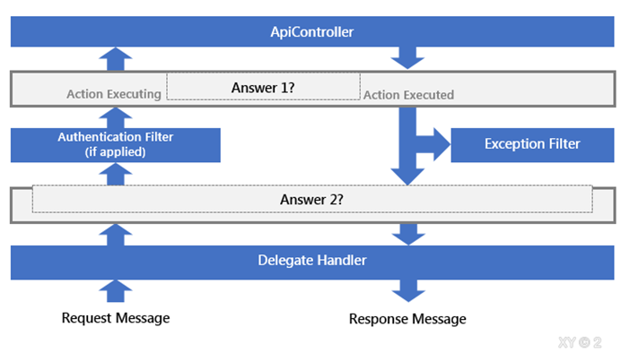
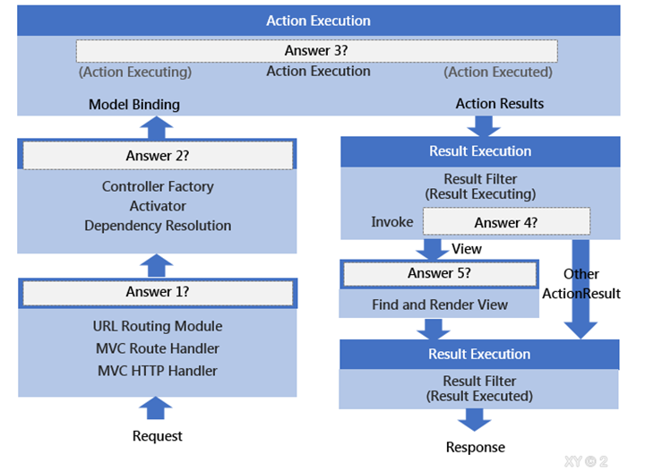

# CUBQuiz

## 一、C#
>1.	API 回傳以下金額資訊，請您將金額 *利率0.33後，由大到小進行排序。 ( - 視為 0 )
string[] amountList = { "1.2", "1.4", "0.2", "-", "-0.005" };


>2.	承上題，請實作單元測試


>3.	客戶傳入信用卡號，請進行信用卡卡號隱碼，信用卡號分為16碼與12碼隱碼規則 : 僅顯示末4碼，其餘以*隱碼，並每四位以 - 分隔開Example :
0123456789012345 -> ****-****-****-2345
012345678901 -> ****-****-8901


>4.	請用泛型實作一個function滿足以下需求:
>>*	輸入參數型別可為 String、Int、DateTime…
>>* 輸出結果為字串型別
>>* 當輸入型別為DateTime時，輸出結果須轉為”xxxx/xx/xx”格式之年月日字串
例如
輸入數字888輸出字串型別"888",
輸入DateTime 2022/6/2 12:05:33輸出字串型別”2022/06/20”


>5.	什麼是Linq的延遲執行? 何時會觸發實際執行?


>6.	使用繼承時有哪些相關的修飾詞? 請列舉及說明。


>7.	請解釋async await是什麼? 有什麼優缺點?


>8.	下列程式的主控台輸出會是?

```C#
Public classB0
{
Public virtual stringGetText()
    {
return"Box0";
    }
}
Public abstract classB1 : B0
{
Public override stringGetText()
    {
return"Box1";
    }
}
Public classB2 : B1
{
Public override stringGetText()
    {
return"Box2";
    }
}
Static classProgram
{
    [STAThread]
Static voidMain()
    {
        B0 box0 = null;
        B1 box1 = new B2();
        box0 = box1;
string result = box0.GetText();
Console.WriteLine(result);
    }
}
```


## 二、DB

>1.	請使用SQL回答問題，DB中有以下三個Table
Students [ ClassID ,StdID , StdName ]
Examiner [ ClassID ,ExerID , ExerName ]
Exam [ ExamType ,ExamSubject , StdID , Score ]
>* 列出每個班級的主考官姓名(ExaminerName)與學生人數
>* 列出ExamType為「FinalExam」的考試，每班所有科目分數相加後，總分最高的學生姓名


>2.	使用預存程序有什麼好處跟缺點? 使用ORM有什麼好處跟缺點?


>3.	設計資料表時, 你會注意到那些事項? 請列舉並解釋你的考量點。


>4.	如果你需要調校SQL陳述式，而執行計畫顯示Table Scan是造成執行緩慢的原因，那你會怎麼做?


>5.	有一個Table定義如下：
```SQL
CREATE TABLE [dbo].[User](
[UserID] [int] NOT NULL,
[UserName] [varchar](100) NULL,
[DateCreated] [datetime2](7) NULL
)
CREATE NONCLUSTERED INDEX IX_User_UserName ON [dbo].[User]
([UserName])
```
>下列哪一段語法能有效使用Index Seek?
>>A.	SELECT UserName FROM [dbo].[User] WHERE UserName Like 'min%'
>>B.	SELECT UserName FROM [dbo].[User] WHERE LEFT(UserName,3) ='min'
>>C.	SELECT UserName FROM [dbo].[User] WHERE UserName like '%min'
>>D.	SELECT UserName FROM [dbo].[User] WHERE UserName like'%min%'
>>E.	SELECT UserName FROM [dbo].[User] WHERE Upper(UserName) like'MIN%'


## 三、ASP.NET
>1.	ASP.NET MVC中的Filter是什麼? 請試著列舉你所知道的Filter，並舉例說明有什麼用處


>2.	如果要在ASP.NET MVC或Web API中記下每個request的log資訊，你會怎麼做? 同樣的機制在ASP.NET Core怎麼做?


>3.	網站實做快取時有哪幾種方式, 請列舉及說明


>4.	在 ASP.NET Core 中，原本 ASP.NET 的程式進入點Application_Start() 由什麼取代?


>5.	我們可以將一個WebAPI的 Request/Response 生命周期簡化為下圖，請依序在空格中填入適當答案。

 
Answer 1：
Answer 2：

>6.	我們可以將一個 ASP.NET MVC 的 Request/Response 生命周期簡化為下圖，請依序在空格中填入適當答案。
 
Answer 1：
Answer 2：
Answer 3：
Answer 4：
Answer 5：


# CUBQuiz-Ans
## 一、C#
>1.	API 回傳以下金額資訊，請您將金額 *利率0.33後，由大到小進行排序。 ( - 視為 0 )
string[] amountList = { "1.2", "1.4", "0.2", "-", "-0.005" };


>2.	承上題，請實作單元測試


>3.	客戶傳入信用卡號，請進行信用卡卡號隱碼，信用卡號分為16碼與12碼隱碼規則 : 僅顯示末4碼，其餘以*隱碼，並每四位以 - 分隔開Example :
0123456789012345 -> ****-****-****-2345
012345678901 -> ****-****-8901


>4.	請用泛型實作一個function滿足以下需求:
>>*	輸入參數型別可為 String、Int、DateTime…
>>* 輸出結果為字串型別
>>* 當輸入型別為DateTime時，輸出結果須轉為”xxxx/xx/xx”格式之年月日字串
例如
輸入數字888輸出字串型別"888",
輸入DateTime 2022/6/2 12:05:33輸出字串型別”2022/06/20”


>5.	什麼是Linq的延遲執行? 何時會觸發實際執行?


>6.	使用繼承時有哪些相關的修飾詞? 請列舉及說明。


>7.	請解釋async await是什麼? 有什麼優缺點?


>8.	下列程式的主控台輸出會是?

```C#
Public classB0
{
Public virtual stringGetText()
    {
return"Box0";
    }
}
Public abstract classB1 : B0
{
Public override stringGetText()
    {
return"Box1";
    }
}
Public classB2 : B1
{
Public override stringGetText()
    {
return"Box2";
    }
}
Static classProgram
{
    [STAThread]
Static voidMain()
    {
        B0 box0 = null;
        B1 box1 = new B2();
        box0 = box1;
string result = box0.GetText();
Console.WriteLine(result);
    }
}
```


## 二、DB

>1.	請使用SQL回答問題，DB中有以下三個Table
Students [ ClassID ,StdID , StdName ]
Examiner [ ClassID ,ExerID , ExerName ]
Exam [ ExamType ,ExamSubject , StdID , Score ]
>* 列出每個班級的主考官姓名(ExaminerName)與學生人數
>* 列出ExamType為「FinalExam」的考試，每班所有科目分數相加後，總分最高的學生姓名


>2.	使用預存程序有什麼好處跟缺點? 使用ORM有什麼好處跟缺點?


>3.	設計資料表時, 你會注意到那些事項? 請列舉並解釋你的考量點。


>4.	如果你需要調校SQL陳述式，而執行計畫顯示Table Scan是造成執行緩慢的原因，那你會怎麼做?


>5.	有一個Table定義如下：
```SQL
CREATE TABLE [dbo].[User](
[UserID] [int] NOT NULL,
[UserName] [varchar](100) NULL,
[DateCreated] [datetime2](7) NULL
)
CREATE NONCLUSTERED INDEX IX_User_UserName ON [dbo].[User]
([UserName])
```
>下列哪一段語法能有效使用Index Seek?
>>A.	SELECT UserName FROM [dbo].[User] WHERE UserName Like 'min%'
>>B.	SELECT UserName FROM [dbo].[User] WHERE LEFT(UserName,3) ='min'
>>C.	SELECT UserName FROM [dbo].[User] WHERE UserName like '%min'
>>D.	SELECT UserName FROM [dbo].[User] WHERE UserName like'%min%'
>>E.	SELECT UserName FROM [dbo].[User] WHERE Upper(UserName) like'MIN%'


## 三、ASP.NET
>1.	ASP.NET MVC中的Filter是什麼? 請試著列舉你所知道的Filter，並舉例說明有什麼用處


>2.	如果要在ASP.NET MVC或Web API中記下每個request的log資訊，你會怎麼做? 同樣的機制在ASP.NET Core怎麼做?


>3.	網站實做快取時有哪幾種方式, 請列舉及說明


>4.	在 ASP.NET Core 中，原本 ASP.NET 的程式進入點Application_Start() 由什麼取代?


>5.	我們可以將一個WebAPI的 Request/Response 生命周期簡化為下圖，請依序在空格中填入適當答案。

 
Answer 1：
Answer 2：

>6.	我們可以將一個 ASP.NET MVC 的 Request/Response 生命周期簡化為下圖，請依序在空格中填入適當答案。
 
Answer 1：
Answer 2：
Answer 3：
Answer 4：
Answer 5：
