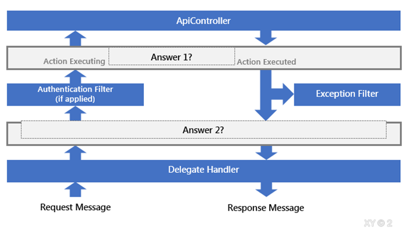
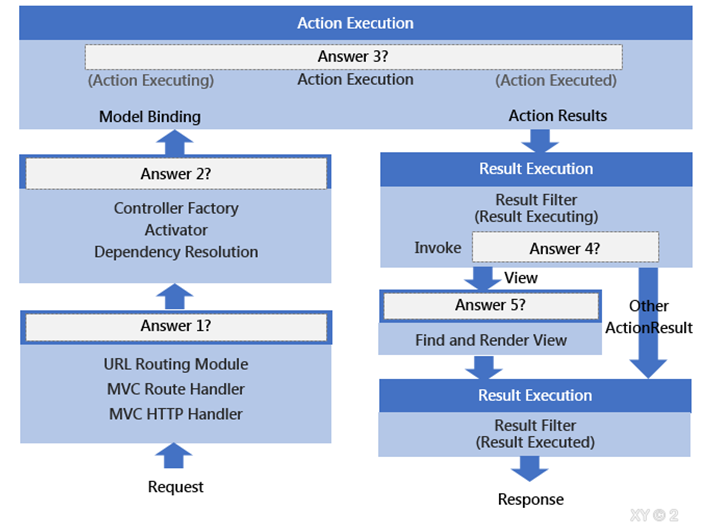
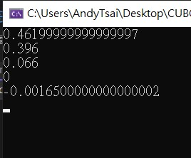
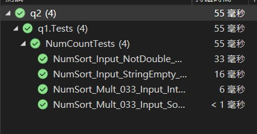
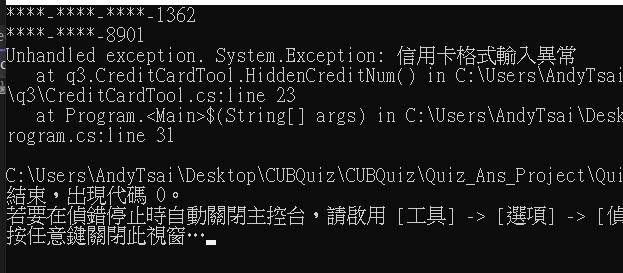
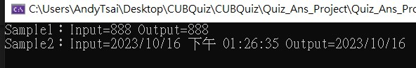
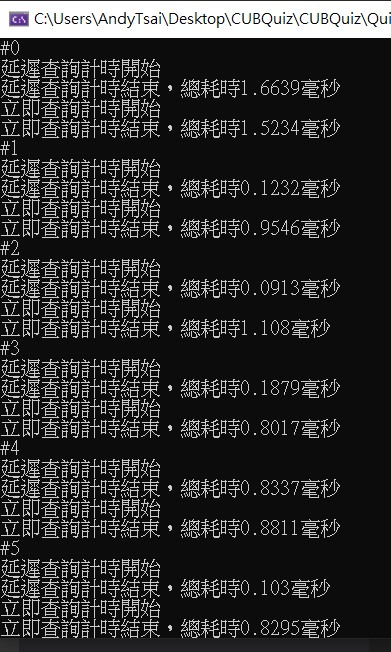
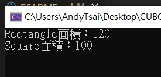
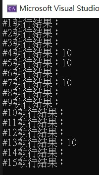

# CUBQuiz

## 一、C#
>1.	API 回傳以下金額資訊，請您將金額 *利率0.33後，由大到小進行排序。 ( - 視為 0 )
string[] amountList = { "1.2", "1.4", "0.2", "-", "-0.005" };


>2.	承上題，請實作單元測試


>3.	客戶傳入信用卡號，請進行信用卡卡號隱碼，信用卡號分為16碼與12碼隱碼規則 : 僅顯示末4碼，其餘以*隱碼，並每四位以 - 分隔開Example :
0123456789012345 -> \*\*\*\*-\*\*\*\*-\*\*\*\*-2345
012345678901 -> \*\*\*\*-\*\*\*\*-8901


>4.	請用泛型實作一個function滿足以下需求:
>>*	輸入參數型別可為 String、Int、DateTime…
>>* 輸出結果為字串型別
>>* 當輸入型別為DateTime時，輸出結果須轉為”xxxx/xx/xx”格式之年月日字串
例如
輸入數字888輸出字串型別"888",
輸入DateTime 2022/6/2 12:05:33輸出字串型別”2022/06/20”


>5.	什麼是Linq的延遲執行? 何時會觸發實際執行?


>6.	使用繼承時有哪些相關的修飾詞? 請列舉及說明。


>7.	請解釋async await是什麼? 有什麼優缺點?


>8.	下列程式的主控台輸出會是?

```C#
Public classB0
{
Public virtual stringGetText()
    {
return"Box0";
    }
}
Public abstract classB1 : B0
{
Public override stringGetText()
    {
return"Box1";
    }
}
Public classB2 : B1
{
Public override stringGetText()
    {
return"Box2";
    }
}
Static classProgram
{
    [STAThread]
Static voidMain()
    {
        B0 box0 = null;
        B1 box1 = new B2();
        box0 = box1;
string result = box0.GetText();
Console.WriteLine(result);
    }
}
```


## 二、DB

>1.	請使用SQL回答問題，DB中有以下三個Table
Students [ ClassID ,StdID , StdName ]
Examiner [ ClassID ,ExerID , ExerName ]
Exam [ ExamType ,ExamSubject , StdID , Score ]
>* 列出每個班級的主考官姓名(ExaminerName)與學生人數
>* 列出ExamType為「FinalExam」的考試，每班所有科目分數相加後，總分最高的學生姓名


>2.	使用預存程序有什麼好處跟缺點? 使用ORM有什麼好處跟缺點?


>3.	設計資料表時, 你會注意到那些事項? 請列舉並解釋你的考量點。


>4.	如果你需要調校SQL陳述式，而執行計畫顯示Table Scan是造成執行緩慢的原因，那你會怎麼做?


>5.	有一個Table定義如下：
```SQL
CREATE TABLE [dbo].[User](
[UserID] [int] NOT NULL,
[UserName] [varchar](100) NULL,
[DateCreated] [datetime2](7) NULL
)
CREATE NONCLUSTERED INDEX IX_User_UserName ON [dbo].[User]
([UserName])
```
>下列哪一段語法能有效使用Index Seek?
>>A.	SELECT UserName FROM [dbo].[User] WHERE UserName Like 'min%'
>>B.	SELECT UserName FROM [dbo].[User] WHERE LEFT(UserName,3) ='min'
>>C.	SELECT UserName FROM [dbo].[User] WHERE UserName like '%min'
>>D.	SELECT UserName FROM [dbo].[User] WHERE UserName like'%min%'
>>E.	SELECT UserName FROM [dbo].[User] WHERE Upper(UserName) like'MIN%'


## 三、ASP.NET
>1.	ASP.NET MVC中的Filter是什麼? 請試著列舉你所知道的Filter，並舉例說明有什麼用處


>2.	如果要在ASP.NET MVC或Web API中記下每個request的log資訊，你會怎麼做? 同樣的機制在ASP.NET Core怎麼做?


>3.	網站實做快取時有哪幾種方式, 請列舉及說明


>4.	在 ASP.NET Core 中，原本 ASP.NET 的程式進入點Application_Start() 由什麼取代?


>5.	我們可以將一個WebAPI的 Request/Response 生命周期簡化為下圖，請依序在空格中填入適當答案。

 
Answer 1：
Answer 2：

>6.	我們可以將一個 ASP.NET MVC 的 Request/Response 生命周期簡化為下圖，請依序在空格中填入適當答案。
 
Answer 1：
Answer 2：
Answer 3：
Answer 4：
Answer 5：


# CUBQuiz-Ans
## 一、C#
>1.	API 回傳以下金額資訊，請您將金額 *利率0.33後，由大到小進行排序。 ( - 視為 0 )
string[] amountList = { "1.2", "1.4", "0.2", "-", "-0.005" };

[專案連結:q1](Quiz_Ans_Project/Quiz_Ans_Project/q1)
```C#
  public string[] NumSort(string[] amountList)
        {
            string[] result = new string[amountList.Length];
            if (amountList.Length <= 0)
                return result;
            double[] doubles = new double[amountList.Length];
            int count = 0;
            foreach (var item in amountList)
            {
                doubles[count] = CheckStringToDouble(item);
                count++;
            }
            result = doubles.Select(n => Multiply(n)).OrderByDescending(n => n).Select(n => n.ToString()).ToArray();
            return result;
        }

        private static double CheckStringToDouble(string stringDouble)
        {
            if (stringDouble == "-")
            {
                return 0;
            }
            else if (!double.TryParse(stringDouble, out double doublecheck))
            {
                throw new AggregateException("輸入格式錯誤");
            }
            else
            {
                return doublecheck;
            }
        }
        private static double Multiply(double inputDouble)
        {
            const double multiplier = 0.33;
            return inputDouble * multiplier;
        }

```


>2.	承上題，請實作單元測試

[專案連結:q2](Quiz_Ans_Project/Quiz_Ans_Project/q2/)
```C#
 [TestClass()]
    public class NumCountTests
    {
        INumCount NumCount;

        public NumCountTests()
        {
            NumCount = new NumCount();
        }

        [TestMethod()]
        public void NumSort_Mult_033_Input_Int_SortDesc_Out_Double()
        {
            string[] amountList = { "1","2","-1","-2" };
            string[] except = { "0.66", "0.33","-0.33", "-0.66" };
            var ans = NumCount.NumSort(amountList);
            CollectionAssert.AreEqual(except, ans);
        }

        [TestMethod()]
        public void NumSort_Mult_033_Input_SortDesc_Out_0()
        {
            string[] amountList = { "-", "-0.5", "-1", "-" };
            string[] except = { "0", "0", "-0.165", "-0.33" };
            var ans = NumCount.NumSort(amountList);
            CollectionAssert.AreEqual(except, ans);
        }

        [TestMethod()]
        public void NumSort_Input_StringEmpty_Out_AggregateException()
        {
            string[] amountList = { "1", " ", "-1", "-2" };
            string except = "輸入格式錯誤";
            try
            {
                var ans = NumCount.NumSort(amountList);
            }
            catch (Exception ex)
            {
                Assert.AreEqual(except,ex.Message);
            }
        }

        [TestMethod()]
        public void NumSort_Input_NotDouble_Out_AggregateException()
        {
            string[] amountList = { "1", "Test", "-1", "-2" };
            string except = "輸入格式錯誤";
            try
            {
                var ans = NumCount.NumSort(amountList);
            }
            catch (Exception ex)
            {
                Assert.AreEqual(except, ex.Message);
            }
        }
    }
```

>3.	客戶傳入信用卡號，請進行信用卡卡號隱碼，信用卡號分為16碼與12碼隱碼規則 : 僅顯示末4碼，其餘以*隱碼，並每四位以 - 分隔開Example :
0123456789012345 -> \*\*\*\*-\*\*\*\*-\*\*\*\*-2345
012345678901 -> \*\*\*\*-\*\*\*\*-8901

[專案連結:q3](Quiz_Ans_Project/Quiz_Ans_Project/q3)
```C#
//Program.cs
string credit16 = "5104315119201362";
string credit12 = "012345678901";
string creditError = "123";

CreditCardModel model = new CreditCardModel()
{
    CreditCardNum = credit16
};

ICreditCardTool tool = new CreditCardTool(model);
var result = tool.HiddenCreditNum();
Console.WriteLine(result.HiddenCreditCardNum);

 model = new CreditCardModel()
{
    CreditCardNum = credit12
 };
 tool = new CreditCardTool(model);
 result = tool.HiddenCreditNum();
Console.WriteLine(result.HiddenCreditCardNum);

model = new CreditCardModel()
{
    CreditCardNum = creditError
};
tool = new CreditCardTool(model);
result = tool.HiddenCreditNum();
Console.WriteLine(result.HiddenCreditCardNum);
Console.ReadLine();
```
```C#
//CreditCardTool.cs
  public class CreditCardTool : ICreditCardTool
    {
        private CreditCardModel CreditCardModel { get; set; }

        public CreditCardTool(CreditCardModel creditCardModel)
        {
            this.CreditCardModel = creditCardModel;
        }

        public CreditCardModel HiddenCreditNum()
        {
            string hiddenNum = string.Empty;
            if(!CheckCreditCardNum())
            {
                throw new Exception("信用卡格式輸入異常");
            }
            switch (CreditCardModel.CreditCardNum.Length)
            {
                case 16:
                    hiddenNum = CreditNum16();
                    break;
                case 12:
                    hiddenNum = CreditNum12();
                    break;
                default:
                    throw new Exception("信用卡其他異常");
            }
            CreditCardModel.HiddenCreditCardNum = hiddenNum;
            return CreditCardModel;

        }

        private string CreditNum16()
        {
            string[] creditNums = {
            CreditCardModel.CreditCardNum.Substring(0,4),
            CreditCardModel.CreditCardNum.Substring(4,4),
            CreditCardModel.CreditCardNum.Substring(8,4),
            CreditCardModel.CreditCardNum.Substring(12,4)
            };
            return ConvertCreditNumToStar(creditNums);
        }

        private string CreditNum12()
        {
            string[] creditNums = {
            CreditCardModel.CreditCardNum.Substring(0,4),
            CreditCardModel.CreditCardNum.Substring(4,4),
            CreditCardModel.CreditCardNum.Substring(8,4),
            };
            return ConvertCreditNumToStar(creditNums);
        }

        private string ConvertCreditNumToStar(string[] creditNums)
        {
            StringBuilder sb = new StringBuilder();
            for (int i = 0; i < creditNums.Length; i++)
            {
                if (i != creditNums.Length - 1)
                    sb.Append("****").Append('-');
                else
                    sb.Append(creditNums[i]);
            }
            return sb.ToString();
        }

        private bool CheckCreditCardNum()
        {
            //找不到12碼驗證規則
            if(CreditCardModel.CreditCardNum.Length == 12)
                return true;
            if (CreditCardModel.CreditCardNum.Length != 16)
                return false;
            int sum = 0;
            bool doubleDigit = false;
            for (int i = CreditCardModel.CreditCardNum.Length - 1; i >= 0; i--)
            {
                int digit = CreditCardModel.CreditCardNum[i] - '0';
                if (doubleDigit)
                {
                    digit *= 2;
                    if (digit > 9)
                    {
                        digit -= 9;
                    }
                }
                sum += digit;
                doubleDigit = !doubleDigit;
            }
            return (sum % 10) == 0;
        }
    }
```

```C#
//CreditCardModel.cs
    public class CreditCardModel
    {
        private string creditCardNum;
        public string  CreditCardNum { get=> creditCardNum; set=> creditCardNum = value.Trim(); }
        public string  HiddenCreditCardNum { get; set; }

    }

```


>4.	請用泛型實作一個function滿足以下需求:
>>*	輸入參數型別可為 String、Int、DateTime…
>>* 輸出結果為字串型別
>>* 當輸入型別為DateTime時，輸出結果須轉為”xxxx/xx/xx”格式之年月日字串
例如
輸入數字888輸出字串型別"888",
輸入DateTime 2022/6/2 12:05:33輸出字串型別”2022/06/20”

[專案連結:q4](Quiz_Ans_Project/Quiz_Ans_Project/q4)
```C#
//Program.cs

using q4;

IConvertHelper helper= new ConvertHelper();
int inputint = 888;
var result = helper.ConvertToString(inputint);
Console.WriteLine("Sample1：Input={0} Output={1}",inputint, result);

DateTime inputdatetime = DateTime.Now;
 result = helper.ConvertToString(inputdatetime);
Console.WriteLine("Sample2：Input={0} Output={1}", inputdatetime, result);

Console.ReadLine();

```

```C#
//IConvertHelper.cs
public interface IConvertHelper
{
    string ConvertToString<T>(T Input);
}

```

```C#
//ConvertHelper.cs
public class ConvertHelper: IConvertHelper
    {
        public string ConvertToString<T>(T Input)
        {
            string result=string.Empty;
            if(typeof(T) ==typeof(string)||typeof(T)==typeof(int))
            {
                result = Input.ToString();
            }
            if (typeof(T) == typeof(DateTime))
            {
                result = Convert.ToDateTime(Input.ToString()).ToString("yyyy/MM/dd");
            }
            return result;
        }
    }

```

>5.	什麼是Linq的延遲執行? 何時會觸發實際執行?

>Ans：Linq延遲執行是指在查詢階段如List.Select(n=>n),List.Where(n=>n.sid=="1")，只會先建立查詢流程，不會執行查詢結果。
實際執行查詢結果為執行ToList()、ToArray()，等實體化時，會執行上述的查詢流程。
執行效率上延遲執行會比立即執行高

[專案連結:q5](Quiz_Ans_Project/Quiz_Ans_Project/q5)

```C#
using System.Diagnostics;

for (int i = 0; i < 100; i++)
{
    Console.WriteLine("#{0}",i);
    DeferredExec();
}
Console.ReadLine();

static void DeferredExec()
{
    List<int> ints = new List<int>();
    Random rnd = new Random();
    for (int i = 0; i < 100000; i++)
    {
        ints.Add(rnd.Next(0, 20));
    }

    Stopwatch stopwatch = Stopwatch.StartNew();

    Console.WriteLine("延遲查詢計時開始");
    var resultint = ints.Where(n => n < 10);
    stopwatch.Stop();
    Console.WriteLine("延遲查詢計時結束，總耗時{0}毫秒", stopwatch.Elapsed.TotalMilliseconds);

     stopwatch = Stopwatch.StartNew();

    Console.WriteLine("立即查詢計時開始");
    var resullist = ints.Where(n => n < 10).ToList();
    stopwatch.Stop();
    Console.WriteLine("立即查詢計時結束，總耗時{0}毫秒", stopwatch.Elapsed.TotalMilliseconds);
}

```



>6.	使用繼承時有哪些相關的修飾詞? 請列舉及說明。

[專案連結:q6](Quiz_Ans_Project/Quiz_Ans_Project/q6)

>Ans：
>>* virtual，讓子類別繼承時可以override父類別的方法
>>* override，子類別修改父類別方法時須使用的修飾詞
>>* new，子類別修改父類別的繼承屬性

```C#
//Program.cs
RectangleBase rectangle = new RectangleBase(20, 6);
Console.WriteLine("Rectangle面積：{0}",rectangle.GetArea());

rectangle = new SquareModel(10);
Console.WriteLine("Square面積：{0}", rectangle.GetArea());
Console.ReadLine();
```

```C#
//RectangleBase.cs
 public  class RectangleBase
    {
        public int Width { get; set; }
        public int Height { get; set; }

        public RectangleBase(int width, int height)
        {
            Width = width;
            Height = height;
        }

        public virtual int GetArea()
        {
            return Width * Height;
        }

    }
```

```C#
//SquareModel.cs
 public class SquareModel : RectangleBase
    {
        public new int Height { get => this.Width; }
        public SquareModel(int width) : base(width,width)
        {

        }

        public override int GetArea()
        {
            return this.Width * Height;
        }
    }
```



>7.	請解釋async await是什麼? 有什麼優缺點?

[專案連結:q7](Quiz_Ans_Project/Quiz_Ans_Project/q7)

>Ans：
>>* 非同步等待，在執行呼叫WebAPI、I/O、DB查詢等功能時，會需要等待執行結果，因此可透過async await，進行多執行緒執行功能，讓程式不會因長時間執行而等待太久，執行效能上也較高。
>>* 缺點如下：
>>>* 程式執行流程複雜，較難偵錯：因採多執行緒，無法評估什麼時候可以獲得執行結果，若在該流程有變數是需要等待該非同步執行完成才能獲得，若沒有注意，可能會發生流程已執行到須向該變數取值，但該變數為Null的異常，會造成程式執行的不穩定。

```C#
//Program.cs
using q7;
AsyncAwait sample=new AsyncAwait();
for (int i = 0; i < 15; i++)
{
    await Task.Delay(1000);
    await sample.Flow();
    Console.WriteLine("#{0}執行結果：{1}",i+1, sample.Result);
}
```

```C#
//AsyncAwait.cs
 public class AsyncAwait
    {
        public int? Result;
        public async Task Flow()
        {
            Result = null;
             AsyncSample1();
             AsyncSample2();
        }

        private async Task AsyncSample1()
        {
            await Task.Delay(1000);
            Result = 10;
        }

        private async Task AsyncSample2()
        {
            await Task.Delay(2000);
        }
    }
```


>8.	下列程式的主控台輸出會是?

```C#
Public classB0
{
Public virtual stringGetText()
    {
return"Box0";
    }
}
Public abstract classB1 : B0
{
Public override stringGetText()
    {
return"Box1";
    }
}
Public classB2 : B1
{
Public override stringGetText()
    {
return"Box2";
    }
}
Static classProgram
{
    [STAThread]
Static voidMain()
    {
        B0 box0 = null;
        B1 box1 = new B2();
        box0 = box1;
string result = box0.GetText();
Console.WriteLine(result);
    }
}
```


## 二、DB

>1.	請使用SQL回答問題，DB中有以下三個Table
Students [ ClassID ,StdID , StdName ]
Examiner [ ClassID ,ExerID , ExerName ]
Exam [ ExamType ,ExamSubject , StdID , Score ]
>* 列出每個班級的主考官姓名(ExaminerName)與學生人數
>* 列出ExamType為「FinalExam」的考試，每班所有科目分數相加後，總分最高的學生姓名


>2.	使用預存程序有什麼好處跟缺點? 使用ORM有什麼好處跟缺點?


>3.	設計資料表時, 你會注意到那些事項? 請列舉並解釋你的考量點。


>4.	如果你需要調校SQL陳述式，而執行計畫顯示Table Scan是造成執行緩慢的原因，那你會怎麼做?


>5.	有一個Table定義如下：
```SQL
CREATE TABLE [dbo].[User](
[UserID] [int] NOT NULL,
[UserName] [varchar](100) NULL,
[DateCreated] [datetime2](7) NULL
)
CREATE NONCLUSTERED INDEX IX_User_UserName ON [dbo].[User]
([UserName])
```
>下列哪一段語法能有效使用Index Seek?
>>A.	SELECT UserName FROM [dbo].[User] WHERE UserName Like 'min%'
>>B.	SELECT UserName FROM [dbo].[User] WHERE LEFT(UserName,3) ='min'
>>C.	SELECT UserName FROM [dbo].[User] WHERE UserName like '%min'
>>D.	SELECT UserName FROM [dbo].[User] WHERE UserName like'%min%'
>>E.	SELECT UserName FROM [dbo].[User] WHERE Upper(UserName) like'MIN%'


## 三、ASP.NET
>1.	ASP.NET MVC中的Filter是什麼? 請試著列舉你所知道的Filter，並舉例說明有什麼用處


>2.	如果要在ASP.NET MVC或Web API中記下每個request的log資訊，你會怎麼做? 同樣的機制在ASP.NET Core怎麼做?


>3.	網站實做快取時有哪幾種方式, 請列舉及說明


>4.	在 ASP.NET Core 中，原本 ASP.NET 的程式進入點Application_Start() 由什麼取代?


>5.	我們可以將一個WebAPI的 Request/Response 生命周期簡化為下圖，請依序在空格中填入適當答案。

 
Answer 1：
Answer 2：

>6.	我們可以將一個 ASP.NET MVC 的 Request/Response 生命周期簡化為下圖，請依序在空格中填入適當答案。
 
Answer 1：
Answer 2：
Answer 3：
Answer 4：
Answer 5：
